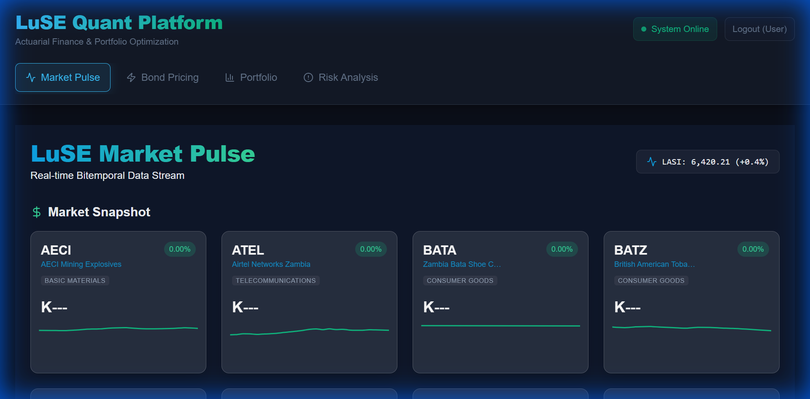

# LuSE Quantitative Investment Analysis Platform

The **LuSE Quantitative Investment Analysis Platform** is a sophisticated fintech solution designed for analyzing the Lusaka Securities Exchange (LuSE). It provides bitemporal market data storage, portfolio optimization (Modern Portfolio Theory), bond pricing (Actuarial CM1), and real-time risk analytics.



## 🚀 Key Features

*   **Market Data**: Real-time and historical price ingestion with bitemporal support (Valid Time vs. Transaction Time).
*   **Analytics Engine**:
    *   **CM1**: Bond Pricing & Yield Curve construction (Nelson-Siegel).
    *   **CM2**: Portfolio Optimization using Mean-Variance analysis.
    *   **Risk**: Monte Carlo simulations and Value at Risk (VaR).
    *   **Backtesting**: Historical strategy simulation with equity curves.
*   **Fintech UI**: Modern, responsive dark-mode dashboard built with React & Tailwind CSS.
    *   **Visualization**: Interactive OHLC charts and Yield Curve plots.
    *   **Reporting**: Exportable PDF Market Summaries.
*   **Security**: 
    *   JWT-based authentication with role-based access control (RBAC).
    *   **Two-Factor Authentication (2FA)**: TOTP support (Google Authenticator).

## 🛠️ Tech Stack

### Backend
*   **Framework**: FastAPI (Python 3.10+)
*   **Database**: TimescaleDB (PostgreSQL extension for time-series)
*   **ORM**: SQLAlchemy 2.0
*   **Tasks**: Celery + Redis (Async background jobs)
*   **Testing**: Pytest

### Frontend
*   **Framework**: React 18 + Vite
*   **Language**: TypeScript
*   **Styling**: Tailwind CSS (Fintech Dark Mode theme)
*   **State Management**: React Hooks / Context API
*   **Charts**: Recharts

### Infrastructure
*   **Containerization**: Docker & Docker Compose
*   **Reverse Proxy**: Nginx (Production build)

## 🏁 Getting Started

### Prerequisites
*   Docker Desktop & Docker Compose
*   Node.js (v18+) & npm (for local frontend dev)
*   Python 3.10+ (for local backend dev)

### 📦 Quick Start (Docker Production)

To run the entire stack (Backend, Frontend, DB, Redis) in a production-like environment:

1.  **Clone the repository**:
    ```bash
    git clone https://github.com/your-org/luse-quant-platform.git
    cd luse-quant-platform
    ```

2.  **Create Production Environment File**:
    Ensure `.env.prod` exists (see *Configuration* below).

3.  **Build and Run**:
    ```bash
    docker-compose -f docker-compose.prod.yml --env-file .env.prod up -d --build
    ```

4.  **Access the Application**:
    *   **Frontend**: `http://localhost`
    *   **API Docs**: `http://localhost:8000/docs`

### 💻 Local Development Setup

#### 1. Backend Setup
```bash
cd backend
python -m venv venv
# Windows
.\venv\Scripts\activate
# Linux/Mac
source venv/bin/activate

pip install -r requirements.txt
uvicorn app.main:app --reload
```
*Backend runs on `http://localhost:8000`*

#### 2. Frontend Setup
```bash
cd frontend
npm install
npm run dev
```
*Frontend runs on `http://localhost:5173`*

#### 3. Database
You must have a Postgres instance running. You can use the docker-compose `postgres` service standalone:
```bash
docker-compose -f docker-compose.prod.yml up -d postgres redis
```

## ⚙️ Configuration

### Environment Variables
Create a `.env` (local) or `.env.prod` (docker) file in the root directory.

| Variable | Description | Default |
| :--- | :--- | :--- |
| `PROJECT_NAME` | App Name | `LuSE Quant Platform` |
| `POSTGRES_SERVER` | DB Host | `localhost` or `postgres` |
| `POSTGRES_USER` | DB User | `postgres` |
| `POSTGRES_PASSWORD` | DB Password | `password` |
| `POSTGRES_DB` | DB Name | `luse_quant` |
| `SECRET_KEY` | JWT Secret | *Change this in prod!* |
| `ACCESS_TOKEN_EXPIRE_MINUTES` | Token validity | `30` |
| `CORS_ORIGINS` | Allowed API Origins | `["http://localhost", "http://localhost:5173"]` |

## 🧪 Testing

### Backend Tests
Run the full test suite (Unit + Integration):
```bash
cd backend
pytest
```
*Coverage report is generated in `htmlcov/`*

## 📚 API Documentation
Once the backend is running, visit:
*   **Swagger UI**: `/docs`
*   **ReDoc**: `/redoc`

Core Endpoints:
*   `/api/v1/auth`: Login/Register
*   `/api/v1/market-data`: Market summaries, tickers, and price history
*   `/api/v1/optimization`: Portfolio optimization tasks

## 📂 Project Structure

```
├── backend/
│   ├── app/
│   │   ├── api/v1/         # Route Handlers
│   │   ├── core/           # Config, DB, Security
│   │   ├── models/         # SQLAlchemy Models
│   │   ├── services/       # Business Logic (Actuarial, Market)
│   │   └── main.py         # App Entrypoint
│   ├── tests/              # Pytest Suite
│   └── Dockerfile
├── frontend/
│   ├── src/
│   │   ├── components/     # UI Components (Auth, Dashboard)
│   │   ├── services/       # API Clients
│   │   └── assets/         # Images/Styles
│   ├── Dockerfile.prod     # Nginx Build
│   └── tailwind.config.js
├── docker-compose.prod.yml # Production Orchestration
└── README.md
```

## 🤝 Contributing

1.  **Fork** the repository.
2.  Create a **Feature Branch** (`git checkout -b feature/NewAlgo`).
3.  **Commit** your changes (`git commit -m 'Add new actuarial model'`).
4.  **Push** to the branch (`git push origin feature/NewAlgo`).
5.  Open a **Pull Request**.

## 📄 License
[MIT License](LICENSE)
